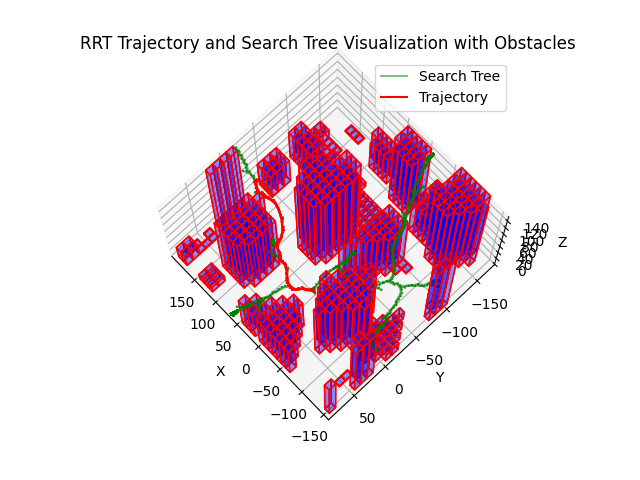

# 3D Trajectory Planning for Autonomous Quadcopters Using RRT

## Project Summary

In this project, I tackled the complex challenge of developing a 3D trajectory planning system for an autonomous quadcopter. This journey began with a clear goal: to navigate a quadcopter through a 3D environment laden with obstacles, ensuring efficient and safe trajectories from a start position to a goal position. Leveraging the Rapidly-exploring Random Tree (RRT) algorithm, I integrated several technical components, including obstacle parsing, pathfinding, and trajectory generation, all brought together with a custom steering function that uses Rodrigues' rotation formula.

Through this project, I demonstrated my engineering mindset and problem-solving abilities by breaking down the problem into manageable components, rigorously testing each part, and integrating them into a cohesive system. The result is a sophisticated trajectory planner capable of generating realistic and feasible flight paths for a quadcopter, showcasing my ability to handle complex technical challenges and think like an engineer.


The following image typifies the results of the project:



### Theory

This section outlines the theoretical foundation and algorithmic steps behind the custom steering function utilized in our 3D path planning algorithm. The objective is to navigate a quadcopter through three-dimensional space from a start point to a target, adhering to the quadcopter's motion constraints.

#### Custom Steering Function

The steering function is crucial for directing the search tree's expansion towards the goal, ensuring the quadcopter's orientation smoothly transitions towards the target direction within its physical limitations.

#### Rodrigues' Rotation Formula

Central to our steering function is Rodrigues' rotation formula, which facilitates the rotation of a vector in three-dimensional space around a specified axis by a certain angle. This formula is key to updating the quadcopter's orientation as it progresses towards the target.

Given:
- $\mathbf{v}$: The initial orientation vector of the quadcopter.
- $\mathbf{u}$: The target direction vector.
- $\mathbf{k}$: The axis of rotation, perpendicular to both $\mathbf{v}$ and $\mathbf{u}$, calculated as $\mathbf{k} = \frac{\mathbf{v} \times \mathbf{u}}{\|\mathbf{v} \times \mathbf{u}\|}$.
- $\theta$: The angle of rotation, calculated as $\theta = \arccos\left(\frac{\mathbf{v} \cdot \mathbf{u}}{\|\mathbf{v}\| \|\mathbf{u}\|}\right)$.

Rodrigues' rotation formula is then applied to compute the new orientation vector $\mathbf{v}_{\text{new}}$:

$$
\mathbf{v}_{\text{new}} = \mathbf{v} \cos\theta + (\mathbf{k} \times \mathbf{v}) \sin\theta + \mathbf{k} (\mathbf{k} \cdot \mathbf{v})(1 - \cos\theta)
$$

This formula ensures a smooth and realistic transition of the quadcopter's orientation towards the target direction, adhering to the maximum allowable steering angle.

#### Clamping the Steering Angle

To ensure the trajectory planning results in gradual and smooth turns, it's crucial to constrain the steering angle at each expansion step. This is achieved by clamping the steering angle to a maximum value, $\theta_{\text{max}}$, which represents the maximum allowable steering angle change between consecutive nodes in the search tree. The process is as follows:

1. **Calculate Desired Steering Angle**: Determine the angle $\theta$ between the parent node's orientation vector $\mathbf{v}$ and the target direction vector $\mathbf{u}$ as previously described.

2. **Clamp Steering Angle**: If the calculated steering angle $\theta$ exceeds $\theta_{\text{max}}$, reduce it to $\theta_{\text{max}}$. This is done while preserving the direction of the turn (left or right) as indicated by the cross product of $\mathbf{v}$ and $\mathbf{u}$.

    if $\theta > \theta_{\text{max}}$, then $\theta = \theta_{\text{max}}$

3. **Apply Clamped Steering Angle**: Use the clamped angle $\theta$ (or $\theta_{\text{max}}$ if the original $\theta$ was exceeded) to update the orientation of the quadcopter, ensuring the turns are gradual and smooth.

This clamping mechanism is integral to the steering function, ensuring that the expansion of the search tree results in trajectories that are not only efficient but also adhere to the physical constraints of the quadcopter, promoting smooth and realistic flight paths.

#### Tree Expansion Algorithm

To expand the search tree towards the goal, the following algorithmic steps are implemented:

1. **Select Parent Node**: Identify the node within the existing tree that is closest to the new sample point, considering both position and orientation.

2. **Calculate Steering Direction**: Determine the target vector $\mathbf{u}$ from the parent node's position to the new sample point.

3. **Apply Steering Function**: Use the custom steering function to calculate the new orientation vector $\mathbf{v}_{\text{new}}$ for the parent node, ensuring the rotation does not exceed the maximum steering angle rate.

4. **Update State with Euler Integration**:
    - **Update Position**: Calculate the new position $\mathbf{p}_{\text{new}}$ by advancing the parent node's position along $\mathbf{v}_{\text{new}}$ for a duration determined by the quadcopter's speed and the time step $dt$.
    - **Update Orientation**: Set the parent node's orientation to $\mathbf{v}_{\text{new}}$.

5. **Add New Node to Tree**: Create a new node with the updated state ($\mathbf{p}_{\text{new}}$, $\mathbf{v}_{\text{new}}$) and add it to the search tree as a child of the parent node.

This approach combines Rodrigues' rotation formula with Euler integration to expand the search tree smoothly and realistically, ensuring the generated trajectory is feasible and adheres to the quadcopter's motion constraints.

## Usage


1. **Compile the Project**: Compile the C++ files using `g++`, ensuring that the include path is set up to recognize the `/libs` directory where `nanoflann.hpp` resides. Use the following command:

    ```shell
    g++ -I./libs -o rrt_planner src/*.cpp
    ```

    This command compiles all C++ source files in the `src` directory, setting the output executable name to `rrt_planner`. The `-I./libs` flag adds the `/libs` directory to the include path, allowing `g++` to find `nanoflann.hpp`.

2. **Run the Executable**: After compilation, execute the generated binary to run the trajectory planning algorithm:

    ```shell
    ./rrt_planner
    ```

3. **Visualize the Trajectory**: Utilize the Python script `visualization/show_trajectory.py` to visualize the generated trajectory. This script relies on Matplotlib and Numpy for rendering the trajectory. Run it with:

    ```shell
    python visualization/show_trajectory.py
    ```

4. **Explore the Results**: Analyze the trajectory to understand the quadcopter's path through the 3D environment. Experiment with different start and goal positions to fully appreciate the capabilities of the trajectory planner.